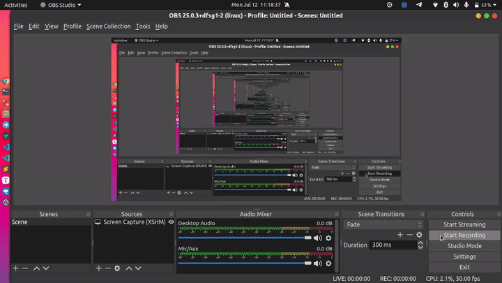

# Getting Started

### Starting Database with Docker

```bash
docker run --name <docker_name> 
 -e POSTGRES_PASSWORD=<password>
 -d -p 5432:5432 postgres:13.3

docker exec -it <docker_name> bash

psql -U postgres
```

### Installing PostgreSQL on windows

* https://www.postgresql.org/download/windows/

### Installing PostgreSQL on MacOS

[https://www.postgresql.org/download/macosx/](https://www.postgresql.org/download/macosx/)

### Setup and Basics : using apt

**Installation**

```bash
sudo apt-get install postgresql
```

**Usage commands**

```bash
service postgresql
```

**Switch to default user**

```
sudo su postgres
```

### Getting Started

#### Connect to a database

```bash
Connection options:
  -h, --host=HOSTNAME      
# database server host or socket directory 
# (default: "local socket")
  -p, --port=PORT          
# database server port 
# (default: "5432")
  -U, --username=USERNAME  
# database user name (default: "root")
  -w, --no-password        
# never prompt for password
  -W, --password           
  # force password prompt (should happen automatically)
```

1. Here port : 5432 is default and can be get from `psql --help`
2. `postgres` is the **super user**. _Create another user and connect using that._
3. to connect to database with user :

```sql
\c db_name user_name
```

### Commands

```sql
-- to list all tables
\dt

-- to list all databases
\l

-- to list all table spaces
\db

-- to list all schemas
\dn

-- to list all indices
\di

-- to list all sequences
\ds

-- to list all roles
\dg

-- to list data types
\dT

-- to list all domain datatypes
\dD

-- to list all views
\dv

-- to list previous commands
\g

-- to list Command History
\s

-- to run command from file
\i filename 
-- it should be inside the server

-- to list help
\h
\h create table

-- to display null
\pset null (null)

-- to make terminal better
\pset linestyle unicode
\pset border 2

-- to watch a command in time
\watch 2

-- to turn on timing
\timing
```

## Load Data

Download the sample data file from here

* [https://drive.google.com/file/d/1vsFVuybjNDacNaV5LmaSI\_\_a6dCpEdmT/view?usp=sharing](https://drive.google.com/file/d/1lssFN3I74qG2e7DuYMw8GeYCoVRo9Wtl/view?usp=drive\_link)


