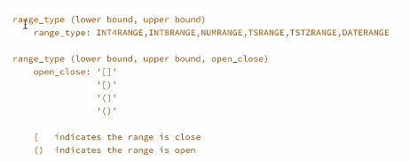

# Arrays

## Arrays

* Original Documentation : [here](https://www.postgresql.org/docs/current/arrays.html)

### Syntax

```sql
column_name DATATYPE[] {CONSTRAINT}
```

```sql
CREATE TABLE table_array
(
    id     SERIAL,
    name   varchar(100),
    grades text[]
);

INSERT INTO table_array (name, grades)
VALUES ('person 1', array ['100','45']);
INSERT INTO table_array (name, grades)
VALUES ('person 2', array ['100','90']);
INSERT INTO table_array (name, grades)
VALUES ('person 3', array ['100','97']);
INSERT INTO table_array (name, grades)
VALUES ('person 4', array ['100','94']);


SELECT name, grades[1]
FROM table_array;

   name   | grades 
----------+--------
 person 1 | 100
 person 2 | 100
 person 3 | 100
 person 4 | 100
```

## Array in Tables

### Insert

* for non text data , use `{value1,value2}` or `array ['value1','value2']`
* for text data , use `{"value1","value2"}` or `array [value1,value2]`

```sql
CREATE TABLE teachers
(
    id    serial primary key,
    class text[]
);

CREATE TABLE IF NOT EXISTS teachers
(
    id    serial primary key,
    class text array
);

INSERT INTO teachers (class)
VALUES (array ['english','maths']);

 id |      class      
----+-----------------
  1 | {english,maths}
```

### Query

```sql
SELECT class[1]
FROM teachers;

  class  
---------
 english


SELECT *
FROM teachers
WHERE class[1] = 'english';

 id |      class      
----+-----------------
  1 | {english,maths}


SELECT *
FROM teachers
WHERE 'english' = any (class);

 id |      class      
----+-----------------
  1 | {english,maths}
```

### Update

```sql
update teachers
set class[1] = 'dutch'
WHERE id = 1;

 id |     class     
----+---------------
  1 | {dutch,maths}

Update teachers
set class[3] = 'science'
WHERE id = 1;

 id |         class         
----+-----------------------
  1 | {dutch,maths,science}
```

### Dimensionless

```sql
CREATE TABLE teacher2
(
    id    serial primary key,
    class text array[1]
);

INSERT INTO teacher2 (class)
VALUES (array ['english']);

 id |   class   
----+-----------
  1 | {english}
    
-- dimensions doesnt matter
INSERT INTO teacher2 (class)
VALUES (array ['english','hindi']);

 id |      class      
----+-----------------
  1 | {english}
  2 | {english,hindi}
```

### Unnest

```sql
SELECT id, class, unnest(class)
FROM teacher2;

 id |      class      | unnest  
----+-----------------+---------
  1 | {english}       | english
  2 | {english,hindi} | english
  2 | {english,hindi} | hindi
```

### Multi Dimensional Array

```sql
CREATE TABLE students
(
    id    serial primary key,
    name  varchar(50) not null,
    grade integer[][]
);

INSERT INTO students (name, grade)
VALUES ('s1', '{90,2020}'),
       ('s1', '{70,2020}'),
       ('s1', '{60,2020}');

SELECT *
FROM students;

 id | name |   grade   
----+------+-----------
  1 | s1   | {90,2020}
  2 | s1   | {70,2020}
  3 | s1   | {60,2020}

SELECT *
FROM students
WHERE grade @> '{90}';

 id | name |   grade   
----+------+-----------
  1 | s1   | {90,2020}

SELECT *
FROM students
WHERE '2020' = any (grade);

 id | name |   grade   
----+------+-----------
  1 | s1   | {90,2020}
  2 | s1   | {70,2020}
  3 | s1   | {60,2020}

SELECT *
FROM students
WHERE grade[1] < 80;

 id | name |   grade   
----+------+-----------
  2 | s1   | {70,2020}
  3 | s1   | {60,2020}
```

### Array vs JSONB

#### Advantages to Array

* It's pretty easy to setup
* Requires less storage than jsonb
* It has multi dimensional support 
* Indexing through GIN, greatly speeds up query
* The PostgreSQL planner is likely to make better decisions with PostgreSQL array, as it collects statistics on its content, but not with JSONB.

#### Disadvantages to Array

* Its main advantages is that you are limited to one data type
* Have to follow strict order of the array data input.

#### Advantages to JSONB

* Provides additional operators for querying
* Support for indexing

#### Disadvantages to JSONB

* Has to parse the json data to binary format
* slow in writing, but faster in reading
* Doesn't maintain order

## Ranges




```sql
SELECT INT4RANGE(1, 6)                                                   AS "DEFAULT [(",
       NUMRANGE(1.432, 6.238, '[]')                                      AS "[]",
       DATERANGE('20200101', '20201222', '()')                           AS "DATES ()",
       TSRANGE(LOCALTIMESTAMP, LOCALTIMESTAMP + INTERVAL '8 DAYS', '(]') AS "OPENED CLOSED";

 DEFAULT [( |      []       |        DATES ()         |                       OPENED CLOSED                       
------------+---------------+-------------------------+-----------------------------------------------------------
 [1,6)      | [1.432,6.238] | [2020-01-02,2020-12-22) | ("2021-08-24 05:22:13.03625","2021-09-01 05:22:13.03625"]


SELECT ARRAY [1,2,3]        AS "INT ARRAYS",
       ARRAY [2.123::FLOAT] AS "FLOATING NUMBERS",
       ARRAY [CURRENT_DATE, CURRENT_DATE + 5];

 INT ARRAYS | FLOATING NUMBERS |          array          
------------+------------------+-------------------------
 {1,2,3}    | {2.123}          | {2021-08-24,2021-08-29}


SELECT ARRAY [1,2,3,4] = ARRAY [1,2,3,4],
       ARRAY [1,2,3,4] = ARRAY [1,1,3,4],
       ARRAY [1,2,3,4] <> ARRAY [1,2,3,4],
       ARRAY [1,2,3,4] < ARRAY [1,5,3,4],
       ARRAY [1,2,3,4] <= ARRAY [1,3,3,4],
       ARRAY [1,2,3,4] > ARRAY [1,2,3,4];
       
 ?column? | ?column? | ?column? | ?column? | ?column? | ?column? 
----------+----------+----------+----------+----------+----------
 t        | f        | f        | t        | t        | f
```

### Inclusion Operators

```sql
SELECT ARRAY [1,2,3,4] @> ARRAY [2,3,4]       AS "CONTAINS",
       ARRAY ['A','B'] <@ ARRAY ['A','B','C'] AS "CONTAINED BY",
       ARRAY [1,2,3,4] && ARRAY [2,3,4]       AS "IS OVERLAP";

 CONTAINS | CONTAINED BY | IS OVERLAP 
----------+--------------+------------
 t        | t            | t
```

### Length and Dimensions

```sql
SELECT ARRAY [1,2,3] || ARRAY [4,5,6] AS "COMBINED ARRAY";

 COMBINED ARRAY 
----------------
 {1,2,3,4,5,6}

SELECT ARRAY_CAT(ARRAY [1,2,3],
                 ARRAY [4,5,6]) AS "COMBINED ARRAY VIA CAT";

 COMBINED ARRAY VIA CAT 
------------------------
 {1,2,3,4,5,6}

SELECT 4 || ARRAY [1,2,3] AS "ADDING TO ARRAY";

 ADDING TO ARRAY 
-----------------
 {4,1,2,3}

SELECT ARRAY [1,2,3] || 4 AS "ADDING TO ARRAY";

 ADDING TO ARRAY 
-----------------
 {1,2,3,4}

SELECT ARRAY_APPEND(ARRAY [1,2,3], 4) AS "USING APPEND";

 USING APPEND 
--------------
 {1,2,3,4}

SELECT ARRAY_PREPEND(4, ARRAY [1,2,3]) AS "USING APPEND";

 USING APPEND 
--------------
 {4,1,2,3}

SELECT ARRAY_NDIMS(ARRAY [[1,2,3,4],[1,2,3,4],[1,2,3,4]]) AS "DIMENSIONS",
       ARRAY_DIMS(ARRAY [1,2,3,4,2,3,4])                  AS "DIMENSIONS";

 DIMENSIONS | DIMENSIONS 
------------+------------
          2 | [1:7]

SELECT ARRAY_LENGTH(ARRAY [-111,2,3,4], 1);

 array_length 
--------------
            4

SELECT ARRAY_UPPER(ARRAY [1,2,3,4000], 1),
       ARRAY_LOWER(ARRAY [-100,2,3,4], 1);
       
 array_upper | array_lower 
-------------+-------------
           4 |           1
```

### Positions

```sql
SELECT array_position(array ['jan','feb','mar'], 'feb');

 array_position 
----------------
              2

SELECT array_position(array [1,2,2,3,4], 2, 3);

 array_position 
----------------
              3
              
SELECT array_positions(array [1,2,2,3,4], 2);
 array_positions 
-----------------
 {2,3}
```

### Search, Replace, Remove

```sql
SELECT array_cat(array [1,2], array [3,4]);

 array_cat 
-----------
 {1,2,3,4}

SELECT array_append(array [1,2,3], 4);

 array_append 
--------------
 {1,2,3,4}

SELECT array_remove(array [1,2,3,4,4,4], 4);

 array_remove 
--------------
 {1,2,3}

SELECT array_replace(array [1,2,3,4,4,4], 4, 5);

 array_replace 
---------------
 {1,2,3,5,5,5}
```

### IN, NOT IN, ANY

```sql
SELECT 20 in (1, 2, 3, 20) as "result";
-- t
SELECT 25 in (1, 2, 3, 20) as "result";
-- f
SELECT 25 not in (1, 2, 3, 20) as "result";
-- t
SELECT 20 = all (Array [20,22]), 20 = all (array [20,20]);
-- f
SELECT 20 = any (Array [1,2,25]) as "result";
-- f
```

### STRING TO Array

```sql
SELECT string_to_array('1,2,3,4,5', ',');

 string_to_array 
-----------------
 {1,2,3,4,5}

SELECT string_to_array('1,2,3,4,5,ABC', ',', 'ABC');

 string_to_array  
------------------
 {1,2,3,4,5,NULL}

SELECT string_to_array('1,2,3,4,,6', ',', '');

 string_to_array  
------------------
 {1,2,3,4,NULL,6}

SELECT array_to_string(ARRAY [1,2,3,4], '|');

 array_to_string 
-----------------
 1|2|3|4

SELECT array_to_string(ARRAY [1,2,3,4,NULL], '|', 'EMPTY');

  array_to_string 
-----------------
 1|2|3|4|EMPTY
```

