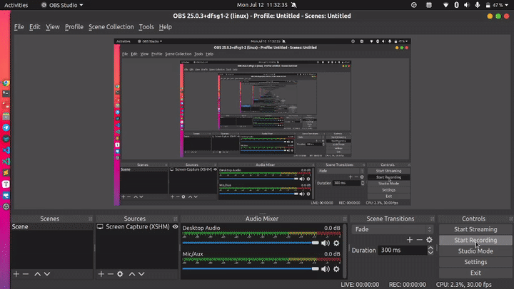

# Database

## Creating a database


## Dropping Database



## Commands

```sql
create database testdb;

drop database if exists testdb;
```

### Connect to DB

```sql
-- using psql
\c test
```

### See list of tables

```sql
-- using psql
\d                       #to see tables
\d <name of table>       #to see details about table
```

