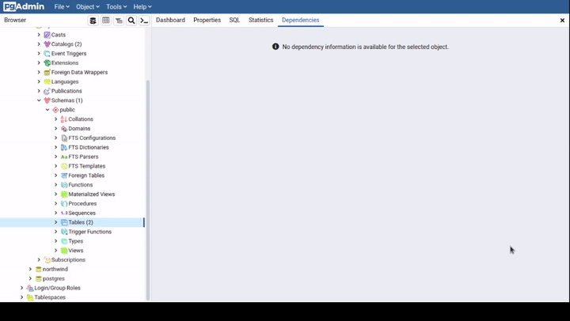

# Table

## Creating Table


## Altering Table



## Add Column


```sql
-- adding column to table
ALTER TABLE [schema].[table name]
    ADD COLUMN [column name] [data type];

-- example
ALTER TABLE public.rainfalls
    ADD COLUMN is_enable boolean [CONSTRAINT];

-- renaming column in table
ALTER TABLE public.rainfalls
    RENAME is_enable TO accurate;

-- add mulitple columns
ALTER TABLE rainfals
ADD COLUMN city VARCHAR(20),
ADD COLUMN pincode VARCHAR(50);

-- create dummy table
CREATE TABLE IF NOT EXISTS wrong_table ( name text );
-- rename table using ALTER
ALTER TABLE wrong_table RENAME TO name_table;
DROP TABLE IF EXISTS name_table;

-- drop column
ALTER TABLE public.rainfalls
DROP COLUMN pincode;

-- change data type of column
ALTER TABLE public.rainfalls
ALTER COLUMN accurate TYPE TEXT;

     Table "public.rainfalls"
  Column  |         Type          | 
----------+-----------------------+-
 location | text                  | 
 year     | integer               | 
 month    | integer               | 
 raindays | integer               | 
 accurate | TEXT                  | 
 city     | character varying(20) | 

-- altering column datatype
ALTER TABLE rainfalls  
ALTER COLUMN accurate TYPE REAL 
USING accurate::REAL;

     Table "public.rainfalls"
  Column  |         Type          | 
----------+-----------------------+-
 location | text                  | 
 year     | integer               | 
 month    | integer               | 
 raindays | integer               | 
 accurate | real                  | 
 city     | character varying(20) | 


-- set default value of column
ALTER TABLE users
ALTER COLUMN is_enable SET DEFAULT 'Y';
```

## Delete

```sql
-- delete table
DROP TABLE IF EXISTS [table name];

-- delete row
DROP TABLE IF EXISTS [table name];

-- delete column
ALTER TABLE [table name] 
DROP column [column name];

-- delete constraints
ALTER TABLE [table name] 
DROP CONSTRAINT [constrain name];
```

## Select

The `SELECT` statement has the following clauses:

* Select distinct rows using **DISTINCT** operator.
* Sort rows using **ORDER BY** clause.
* Filter rows using **WHERE** clause.
* Select a subset of rows from a table using **LIMIT** or **FETCH** clause.
* Group rows into groups using **GROUP BY** clause.
* Filter groups using **HAVING** clause.
* Join with other tables using joins such as **INNER JOIN**, **LEFT JOIN**, **FULL OUTER JOIN**, **CROSS JOIN** clauses.
* Perform set operations using **UNION**, **INTERSECT**, and **EXCEPT**.

```sql
SELECT first_name, last_name
FROM directors
LIMIT 5;
```

| Representation | Function |
| :--- | :--- |
| ASC | Ascending |
| DESC | Descending |

```sql
SELECT * FROM directors LIMIT 3;

 director_id | first_name | last_name | date_of_birth | nationality 
-------------+------------+-----------+---------------+-------------
           1 | Tomas      | Alfredson | 1965-04-01    | Swedish
           2 | Paul       | Anderson  | 1970-06-26    | American
           3 | Wes        | Anderson  | 1969-05-01    | American

SELECT * FROM directors ORBER BY date_of_birth ASC|DESC;

SELECT DISTINCT nationality FROM directors;

-- to select one column with condtion
SELECT * FROM directors WHERE nationality = 'Chinese'; 

-- Two or more conditions
SELECT 
           * 
FROM 
           directors 
WHERE 
           nationality = 'Mexican' 
           AND 
           date_of_birth='1964-10-09';
```

## Column Alias

```sql
-- normal column aliases
SELECT 
   first_name || ' ' || last_name as full_name
FROM 
   directors LIMIT 5;

-- with spaces
SELECT
    first_name || ' ' || last_name "full name"
FROM
    customer;
```

## Insert

```sql
CREATE TABLE IF NOT EXISTS temp_table (
    col1 text,
    col2 text,
);

INSERT INTO table (col1, col2) 
    VALUES ( 'VALUE 1' , 'VALUE 2');

-- MULTIPLE
INSERT INTO table (col1, col2) 
    VALUES ( 'VALUE 1' , 'VALUE 2','VALUE 3','VALUE 4');

-- STRING WITH QUOTES , add another ' before '
INSERT INTO table (col1) 
    VALUES ( 'VALUE''S 1' );

-- RETURNING ROWS
INSERT INTO temp_table (col1, col2) 
    VALUES ( 'VALUE 5' , 'VALUE 6')
    RETURNING *;
```

## Updating

```sql
UPDATE directors set last_name = 'Walker' 
where director_id = 2;

-- returning updated row
update actors set last_name = 'Anderson' 
where director_id = 150 returning *;

-- update all records
update [table name] set [column name] = [value];

UPDATE [table name]
SET email = 'not found'
WHERE
    email IS NULL;
```

## Upsert

```sql
-- syntax for upsert
INSERT INTO tablename ( col_list ) VALUES 
    ( value_list ) ON CONFLICT (COL_NAME)
    DO
        NOTHING 
        -- OR
        UPDATE SET col = val where condition;

-- syntax for upsert
INSERT INTO tablename ( COL_NAME ) VALUES 
    ( value_list ) ON CONFLICT (COL_NAME)
    DO
        UPDATE SET COL_NAME = EXCLUDED.COL_NAME;
```

