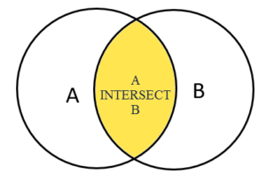

# Combining Tables

## UNION

* Combines result sets from two or more `SELECT` statements into a single result set.
* **The order and number of the columns in the select list of all queries must be the same**

```sql
-- load sample data
DROP TABLE IF EXISTS top_rated_films;
CREATE TABLE top_rated_films(
	title VARCHAR NOT NULL,
	release_year SMALLINT
);

DROP TABLE IF EXISTS most_popular_films;
CREATE TABLE most_popular_films(
	title VARCHAR NOT NULL,
	release_year SMALLINT
);

INSERT INTO 
   top_rated_films(title,release_year)
VALUES
   ('The Shawshank Redemption',1994),
   ('The Godfather',1972),
   ('12 Angry Men',1957);

INSERT INTO 
   most_popular_films(title,release_year)
VALUES
   ('An American Pickle',2020),
   ('The Godfather',1972),
   ('Greyhound',2020);
   
```

### Union Query

```sql
SELECT * FROM top_rated_films
UNION
SELECT * FROM most_popular_films;

          title           | release_year 
--------------------------+--------------
 An American Pickle       |         2020
 Greyhound                |         2020
 The Shawshank Redemption |         1994
 The Godfather            |         1972
 12 Angry Men             |         1957
```

### Union All Query

This will not avoid duplicate values

```sql
SELECT * FROM top_rated_films
UNION ALL
SELECT * FROM most_popular_films;

               title      | release_year 
--------------------------+--------------
 The Shawshank Redemption |         1994
--  The Godfather         |         1972
 12 Angry Men             |         1957
 An American Pickle       |         2020
-- The Godfather          |         1972
 Greyhound                |         2020
```

### UNION with ORDER BY

```sql
SELECT * FROM top_rated_films
UNION ALL
SELECT * FROM most_popular_films
ORDER BY title;

          title           | release_year 
--------------------------+--------------
 12 Angry Men             |         1957
 An American Pickle       |         2020
 Greyhound                |         2020
 The Godfather            |         1972
 The Godfather            |         1972
 The Shawshank Redemption |         1994
```

## Intersect

Like the [UNION](https://www.postgresqltutorial.com/postgresql-union/) and [EXCEPT](https://www.postgresqltutorial.com/postgresql-tutorial/postgresql-except/) operators, the PostgreSQL `INTERSECT` operator combines result sets of two or more [SELECT](https://www.postgresqltutorial.com/postgresql-select/) statements into a single result set.

The `INTERSECT` operator returns any rows that are available in both result sets.



```sql
SELECT *
FROM most_popular_films 
INTERSECT
SELECT *
FROM top_rated_films;

     title     | release_year 
---------------+--------------
 The Godfather |         1972
```

## Except

The `EXCEPT` operator returns distinct rows from the first (left) query that are not in the output of the second (right) query.\\

```sql
SELECT * FROM top_rated_films
EXCEPT 
SELECT * FROM most_popular_films;

          title           | release_year 
--------------------------+--------------
 The Shawshank Redemption |         1994
 12 Angry Men             |         1957
```
