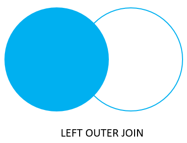
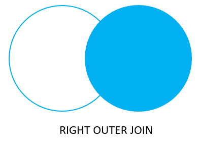

# Left and Right JOIN

## Left Join



### Basic

* Returns every row from **LEFT** table plus rows that match values in the joined column from the **RIGHT** table

### Syntax

```sql
SELECT table1.column1,
       table2.column1
FROM table1
         LEFT JOIN
     table2
     ON
         table1.column1 = table2.column2
```

### Loading Sample Data

```sql
create table left_product
(
    product_id   INT PRIMARY KEY,
    product_name VARCHAR(100)
);

CREATE TABLE right_product
(
    product_id   INT PRIMARY KEY,
    product_name VARCHAR(100)
);

INSERT INTO left_product ( PRODUCT_ID, PRODUCT_NAME )
    VALUES (1,'a'),('2','B'),('3','C'),('5','E');

INSERT INTO right_product ( PRODUCT_ID, PRODUCT_NAME )
    VALUES (1,'a'),('2','B'),('3','C'),('4','d'),(7,'E1');
```

```sql
-- left join selects all data in the left data and
-- picks all data in the right table matching the condition

SELECT
    *
from left_product
left join
    right_product 
    on left_product.product_id = right_product.product_id;
    
 product_id | product_name | product_id | product_name 
------------+--------------+------------+--------------
          1 | a            |          1 | a
          2 | B            |          2 | B
          3 | C            |          3 | C
          5 | E            |-- no match | -- no match

-- select name from director table
-- and select movie from another table
-- where director.id matches director id in movies table

select
    dir.first_name,
    dir.last_name,
    mv.movie_name
from
     directors dir
left join movies mv
    ON mv.director_id = dir.director_id
limit 5;

 first_name | last_name |       movie_name       
------------+-----------+------------------------
 Tomas      | Alfredson | Let the Right One In
 Paul       | Anderson  | There Will Be Blood
 Wes        | Anderson  | The Darjeeling Limited
 Wes        | Anderson  | Rushmore
 Wes        | Anderson  | Grand Budapest Hotel

-- same above query with where clause

select dir.first_name || ' ' || dir.last_name
           as "Directors Name",
       mv.movie_name,
       mv.movie_lang
from directors dir
         left join movies mv
                   ON mv.director_id = dir.director_id
where mv.movie_lang in ('English', 'Chinese');
```

## Right Join



### Syntax

```sql
SELECT 
    table1.column1,
    table2.column2
FROM
    table1
RIGHT JOIN
    table2 
    ON table1.column1 = table2.column2;
```

### Load Sample Data

```sql
CREATE TABLE films
(
    film_id SERIAL PRIMARY KEY,
    title   varchar(255) NOT NULL
);

INSERT INTO films(title)
VALUES ('Joker'),
       ('Avengers: Endgame'),
       ('Parasite');

CREATE TABLE film_reviews
(
    review_id SERIAL PRIMARY KEY,
    film_id   INT,
    review    VARCHAR(255) NOT NULL
);

INSERT INTO film_reviews(film_id, review)
VALUES (1, 'Excellent'),
       (1, 'Awesome'),
       (2, 'Cool'),
       (NULL, 'Beautiful');
```

```sql
-- contains products from left table 
-- that are in right table
-- and all rows from right table that do not
-- match anything from left

SELECT
    *
from left_product
right join
    right_product
    on left_product.product_id = right_product.product_id;

 product_id | product_name | product_id | product_name 
------------+--------------+------------+--------------
          1 | a            |          1 | a
          2 | B            |          2 | B
          3 | C            |          3 | C
            |              |          4 | d
            |              |          7 | E1


SELECT review, title
FROM films
RIGHT JOIN film_reviews using (film_id)
WHERE title IS NULL;

  review   | title 
-----------+-------
 Beautiful | 
```

