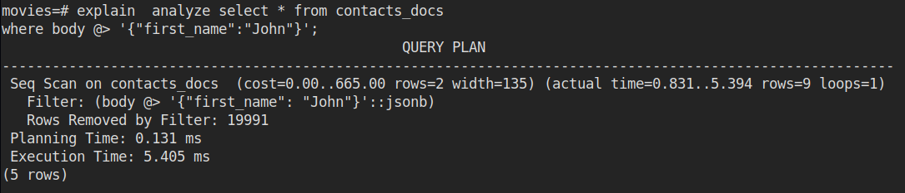
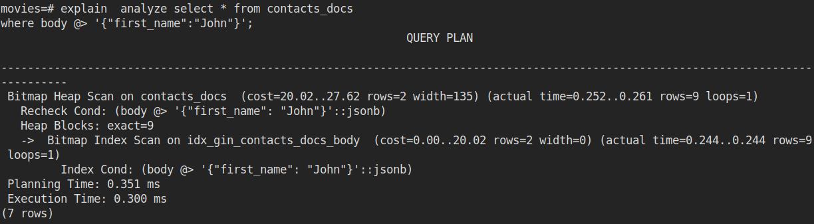
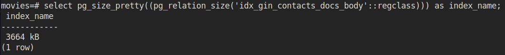
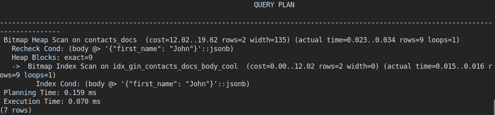
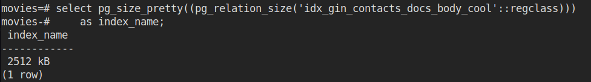
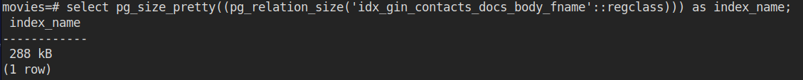

# GIN Index

* GIN index stands for Generalised Invert Index.
* Speeds up full text searches
* A GIN index stores a set of \(key, posting list\) pairs, where a posting list is a set of row IDs in which the key occurs. The same row ID can appear in multiple posting lists, since an item can contain more than one key. 
* Each key value is stored only once, so a GIN index is very compact for cases where the same key appears many times.

## Query

```sql
select * from contacts_docs
where body @> '{"first_name":"John"}';


explain select * from contacts_docs
where body @> '{"first_name":"John"}';
```


## Creating a GIN Index

```sql
create index idx_gin_contacts_docs_body on contacts_docs USING GIN(body);
```



## Get Size of Index

```sql
select pg_size_pretty((pg_relation_size('idx_gin_contacts_docs_body'::regclass))) 
    as index_name;
```



## Using JSONB\_PATH\_OPS \( better \)

```sql
create index idx_gin_contacts_docs_body_cool
    on contacts_docs USING GIN(body jsonb_path_ops);
```



### Size with jsonb\__path\_ops_

```sql
select pg_size_pretty((pg_relation_size('idx_gin_contacts_docs_body_cool'::regclass))) 
    as index_name;
```



## On Specific column for smaller size \( not working \)

```sql
select pg_size_pretty((pg_relation_size('idx_gin_contacts_docs_body_fname'::regclass))) 
    as index_name;
```



