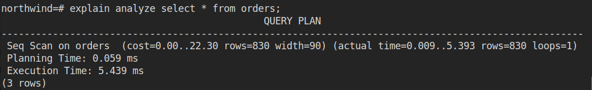
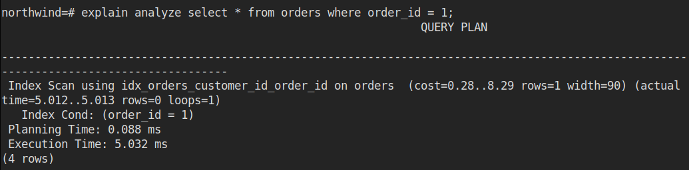
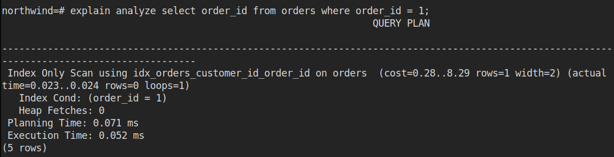
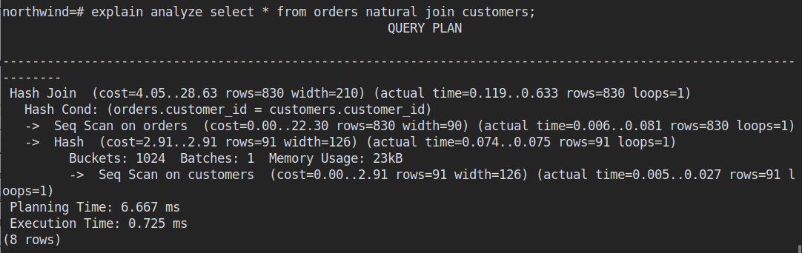

# SQL

## Lifetime of Query

* **Parser** : handles the textual form of the statement and verifies whether it is correct or not
* **Re-writer** : applying the syntactic rules to rewrite the original SQL statement.
* **Optimiser** : finding the fastest path to the data
* **Executor** : responsible for effectively going to the storage  and retrieving the data from the physical storage.

## Optimiser

* Finds all the paths and gets the path with cheapest COST
* **LOWEST COST WINS !!**

## Scan Nodes

* Nodes are available for :
  * every operation
  * every access methods
* Nodes are stack-able
  * Parent Node \( cost = 0.00 ... \)
    * Child Node
      * Child Node
* Types of Nodes

  * Sequential Scan
  * Index Scan, Index Only Scan, Bitmap Index Scan
  * Nested Loop, Hash Join and Merge Join 
  * Gather and Merge parallel nodes

  **Get All Node Types** : `SELECT * FROM pg_am;`

### Sequential Scan

Performs a sequential scan on the whole table.

### Index Scan

* Index is used to access Data
* Types
  * Index scan
  * Index only scan
  * Bitmap Index

### Index only scan

### Hash Join

* Used when joining tables 
* Joins preformed on 2 table at a time, if more tables are joined together, the output at one join in treated as input to a subsequent join
* When joining large number of tables, the genetic query optimiser settings may effect what combinations of joins are considered.

**Types**

* Inner Table : Build a hash table from the inner table, keyed by the join key.
* Outer Table : then scan the outer table checking if a corresponding value is present 

Memory Size \( used by sort operation and hash table \) : `4 MB`

